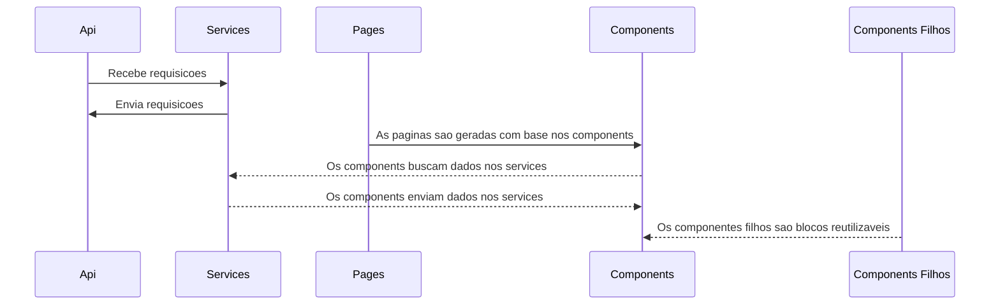

# ProductSoftexpertFront

Logo abaixo vou mostrar um **passo a passo** de como **executar** este projeto, também vou explicar sua estrutura e peculiaridades.

O que será necessário para **executar** o projeto.

- Node: versao 20+

- Executar na porta 3000 (para previnir problemas de cors, possuem headers na API para tratar isso)

- Estou usando Yarn, sugestao de comando **yarn start --port=3000**

## Regras
### Usuários
**email**:  [admin@admin.com](mailto:admin@admin.com)
**password**: Teste123@

O sistema possui um cadastro de usuários, todas as rotas do sistema são protegidas por uma logica simplificada JWT implementada no código, não usei nenhuma biblioteca. 

### Tipos de produto
Cadastro padronizado com rotas protegidas.

### Produtos
Cadastro padronizado com rotas protegidas. Foi criada uma tabela de relacionamento com regras para um produto ter um tipo, mas um tipo ter vários produtos.

### Vendas
Cadastro das vendas realizadas, temos algumas validações de usabilidade, se o usuário, produto ou tipo de produto for excluído, e ele estiver relacionado com uma venda, essas vendas não serão exibidas. (Não exclui para não perder o histórico).
Também foi criada uma validação com base em quantidade em estoque, cada produto tem uma quantidade, toda vez que e cadastrada uma compra, ele verifica se tem a quantidade em estoque.
- Caso a quantidade da venda seja menor que a do estoque, ele cadastra a a venda e atualiza a quantidade no estoque, diminuindo para deixar funcional.
- Caso a quantidade de venda seja maior que a quantidade em estoque, ele não permite o registro da venda.

## Considerações finais

O sistema possui dados fictícios para testes iniciais. 

### Tipos de produto

## Estrutura

 
    | Project
    |-- .next
    |-- node_modules
    |-- public
    |-- src
    | |-- aoo
    | |-- components
    | |-- css
    | |-- fonts
    | |-- hooks
    | |-- js
    | |-- services
    | |-- types
    | |-- utils

  
  

Utilizei os frameworks ReactJs + NextJs.

Meus componentes possuem o mesmo padrao porem com algumas peculiaridades.

