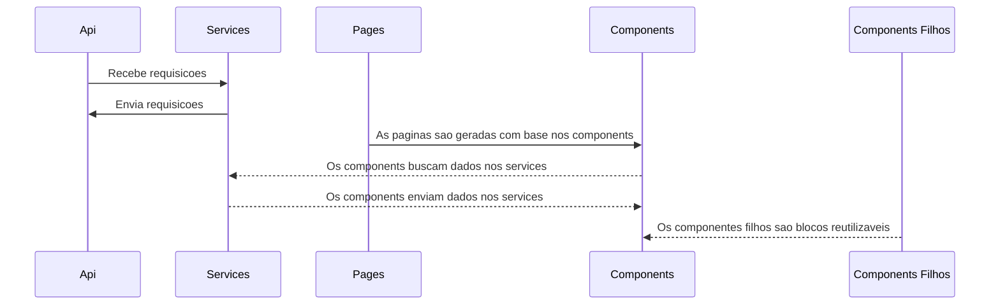

# ProductSoftexpertFront

Logo abaixo vou mostrar um **passo a passo** de como **executar** este projeto, também vou explicar sua estrutura e peculiaridades.

O que será necessário para **executar** o projeto.

- Node: versao 20+
- Executar na porta 3000 (para previnir problemas de cors, possuem headers na API para tratar isso)
  - Estou usando Yarn, sugestao de comando **yarn start --port=3000**
 
## Estrutura

    | Project
        |-- .next
        |-- node_modules
        |-- public
        |-- src
        |   |-- aoo
        |   |-- components
        |   |-- css
        |   |-- fonts
        |   |-- hooks
        |   |-- js
        |   |-- services
        |   |-- types
        |   |-- utils

Utilizei os frameworks ReactJs + NextJs.
Meus componentes possuem o mesmo padrao porem com algumas peculiaridades.

